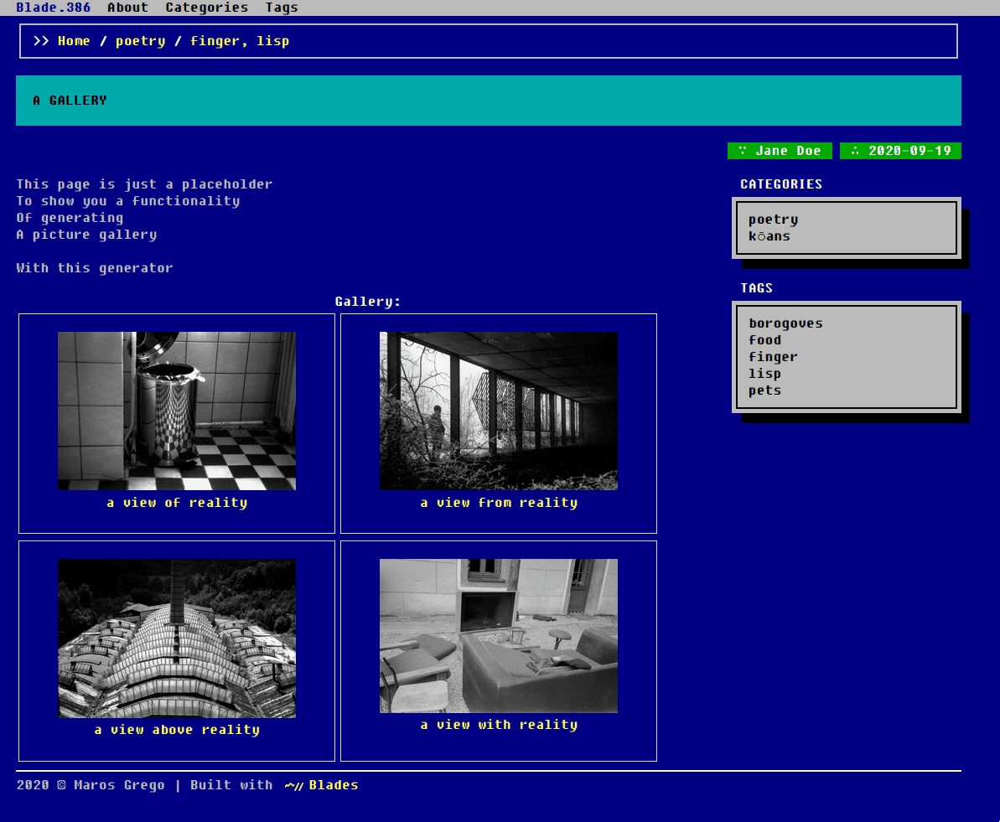

# BLADE.386



## [Live demo](https://blade386.netlify.app/)

BLADE.386 is a port of the BOOTSTRA.386 theme for [Blades](https://github.com/grego/blades) based on:

- [BOOTSTRA.386](https://kristopolous.github.io/BOOTSTRA.386/): main idea, design.
- [HUGO.386](https://themes.gohugo.io/hugo.386/): item placement.
- [ZOLA.386](https://github.com/lopes/zola.386): internal structure.


## Installation
Clone it into your themes directory:
```bash
$ cd themes
$ git clone https://github.com/grego/BLADE.386
```

Or use it as a submodule:
```bash
$ cd themes
$ git submodule add https://github.com/grego/BLADE.386 
```

Then, set it as a theme in your `Blades.toml`:
```toml
theme = "BLADE.386"
```

## Images
If you want to use the picture gallery provided by this theme, place your thumbnails in the
`img/thumb` and your full images to the `img/full` subdirectories of your output directory
(which defaults to `public`, unless set otherwise in the config).

## License
[MIT](LICENSE)
